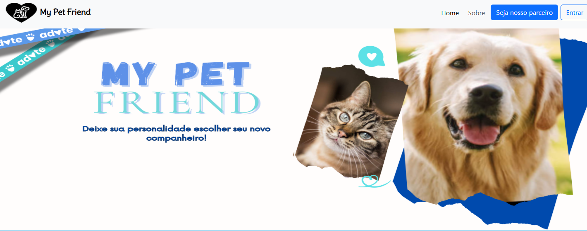
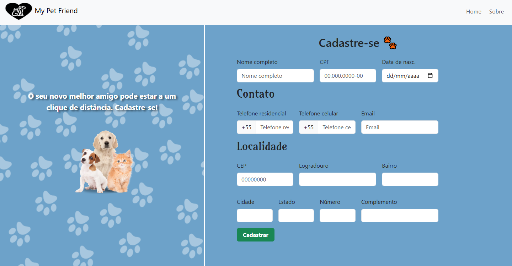
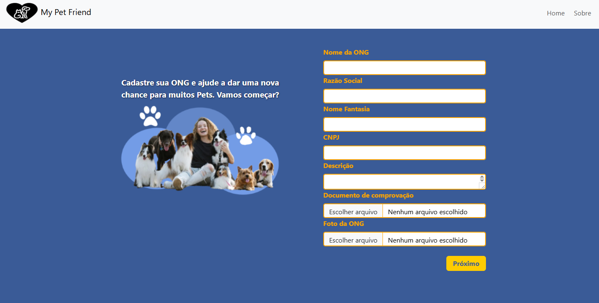
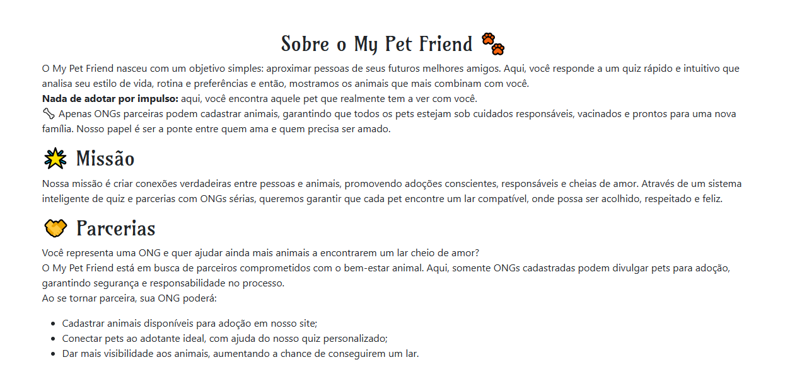

# My Pet friend

Este projeto foi desenvolvido por estudantes do curso técnico em Informática do Senac. Desenvolvemos uma aplicação web fullstack simples e funcional para adoção de animais, baseada na personalidade do usuário.
Nosso objetivo é tornar o processo de adoção mais responsável, mágico e prático.

## Desenvolvedores do projeto
- Matheus Amorim   (https://github.com/Amorimo)
- Yesenia Salas    (https://github.com/Yessalas)
- Nicoli Santos    (https://github.com/Nic0libatista)
- Gabriela Queiroz (https://github.com/GabrielaQueirozs)

## Tecnologias Utilizadas
- **HTML5**
- **CSS3**
- **Bootstrap 5**
- **JavaScript**
- **TypeScript**

## O que é o projeto?

Nosso projeto é uma plataforma dedicada à adoção de pets, conectando pessoas que desejam adotar com ONGs e protetores que estão em busca de lares responsáveis para seus animais.

ONGs podem se cadastrar no sistema para registrar seus dados e futuramente cadastrar os pets disponíveis.

Diferencial: contamos com um quiz interativo que ajuda o usuário a descobrir qual tipo de pet mais combina com seu estilo de vida, tornando o processo de adoção mais consciente e assertivo.

## Funcionalidades

- **Cadastro de usuários com nome, e-mail, telefone e senha  etc**
- **Cadastro de ONGs com nome, e-mail, telefone, CNPJ, Endereço etc**
- **Quiz para o seu pet ideal**
- **Ongs recebem notificações quando o usuário deseja adotar um pet**
- 

## Capturas 
 Página inicial

 

 Cadastro Usuário

 

Cadastro ONG

Sobre Nós 

